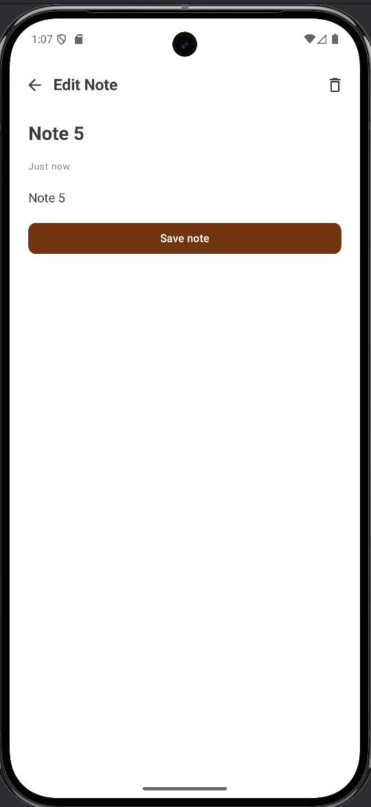
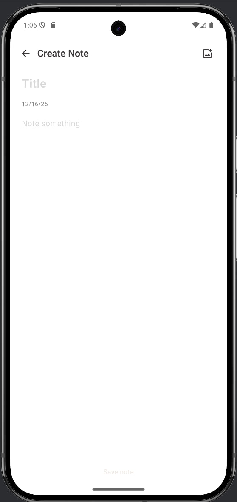

# 📝 Notes App

Простое Android-приложение для управления заметками

---

## ✨ Функционал

- ✅ Добавление новых заметок  
- ✏️ Редактирование существующих  
- 🗑️ Удаление заметок
- Поиск заметок
- Добавление фото для заметки

---

## 🛠 Технологии

---

## 📸 Скриншоты

---
