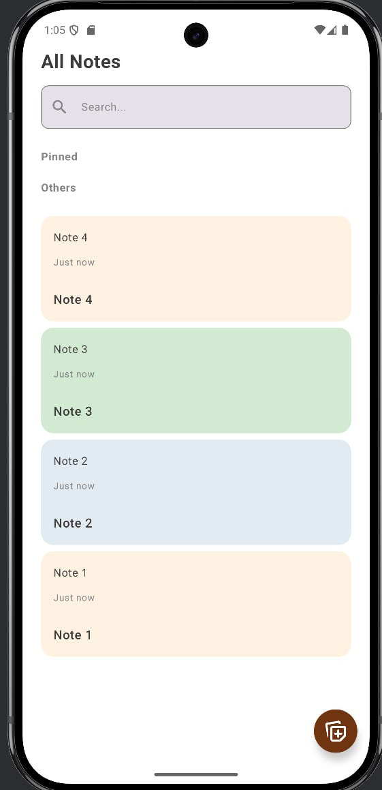
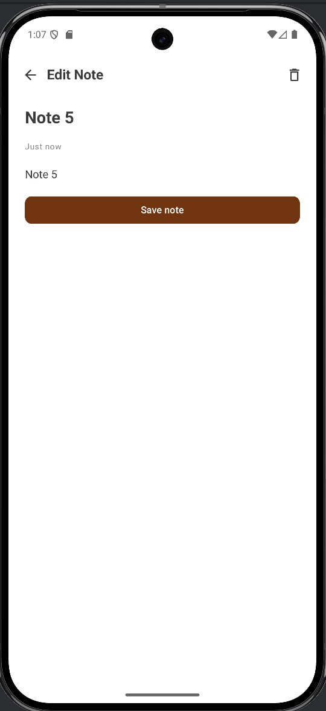
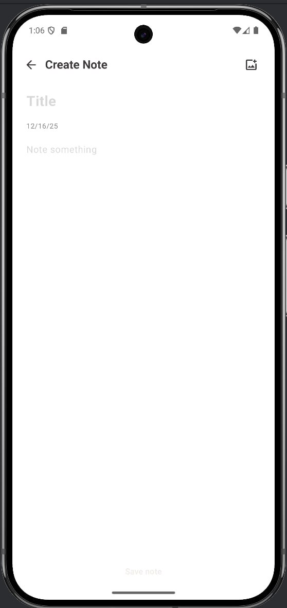

# 📝 Notes App

Простое Android-приложение для управления заметками
Clean Architecture + MVVM
---

## ✨ Функционал

- ✅ Добавление новых заметок  
- ✏️ Редактирование существующих  
- 🗑️ Удаление заметок
- 🔍 Поиск заметок
- 🖼️ Добавление фото для заметки

---

## 🛠 Технологии

---

## 📸 Скриншоты

---
